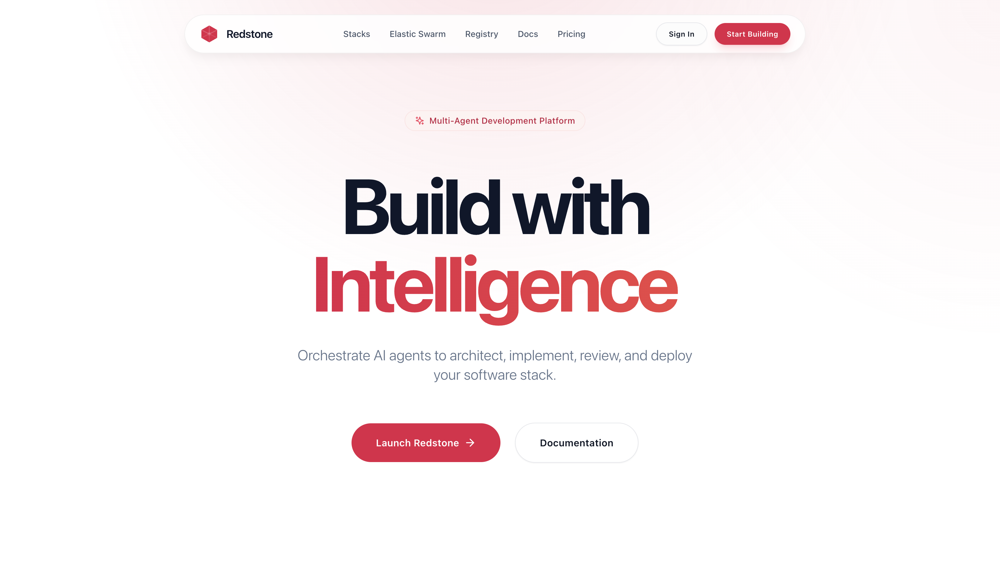

# Redstone Platform



> **The Elastic Multi-Agent Orchestration Platform for Modern Engineering.**

Redstone is the world's first **Elastic Multi-Agent Orchestration Platform** built for engineers, testers, and creative developers. It transforms software development from a constrained, manual process into an infinite, scalable workflow by deploying swarms of specialized AI agents to work alongside you.

Whether you're a solo developer building an MVP or an enterprise team managing microservices, Redstone gives you an on-demand workforce to scale your capabilities.

## Unlock Infinite Engineering Capacity

In today's fast-paced digital economy, your ideas shouldn't be limited by hours in the day. Redstone breaks the linear relationship between time and output.

By augmenting your workflow with an elastic digital workforce, Redstone allows you to:
*   **Scale Your Team Instantly**: Spin up a full team of QA, Security, and Dev agents in seconds.
*   **Reduce Operational Costs**: Automate repetitive tasks like refactoring, documentation, and testing for a fraction of the cost of manual labor.
*   **Focus on Creativity**: Let agents handle the implementation details while you focus on high-level architecture and problem-solving.

## Key Capabilities

### The Elastic Swarm Engine
Redstone's core is a high-performance orchestration layer designed for **flexibility and composability**. Unlike rigid chatbot loops, the Swarm Engine executes complex, multi-stage workflows as Directed Acyclic Graphs (DAGs).

*   **Custom Agent Definitions**: Define agents with unique personas, specific system prompts, and tool access permissions.
*   **Model Agnostic**: Mix and match models (e.g., Claude 3.5 for Architecture, GPT-4o for Coding, Gemini Pro for Testing) within the same swarm.
*   **Context Chaining**: The engine automatically manages context windows, passing outputs from upstream agents (like an Architect's design doc) to downstream agents (like an Implementation bot) losing zero fidelity.

### Agent Stacks & Registry
The **Redstone Registry** provides the building blocks for your swarms. You can compose teams using these specialized, pre-trained roles:

*   **Architect Agent**: Defines system architecture, component boundaries, and enforces invariants.
*   **Product Agent**: Translates user requirements into actionable specifications.
*   **Build Test Agent**: Executes builds and runs tests with execution-grounded feedback.
*   **Integrator Agent**: Merges changes and resolves conflicts.
*   **Reviewer Agent**: Audits code for security and standards.
*   **Infra Agent**: Handles CI/CD and deployment.
*   **Implementation Agent**: Writes code following specifications.

Don't want to build a team from scratch? Use our pre-configured **Stacks**:

*   **Architect Pro**: Best for system design. Uses Claude 3.5 Sonnet.
*   **Speed Demon**: Optimized for fast iteration. Uses GPT-4o-mini.
*   **Full Stack**: Balanced stack for production. Combines Claude and GPT-4o.
*   **Budget Builder**: Cost-effective development with Gemini Pro.
*   **Security First**: Security-focused stack with enhanced review.

### Custom Workflow Design
For full control, use the **Redstone API** to design your own custom agent teams. Define workflows via **YAML** or **JSON** configuration, set permission boundaries, and script complex interactions between agents to suit your exact engineering needs.

```yaml
name: Feature Squad
agents:
  lead_architect:
    type: architect
    model: anthropic/claude-3.5-sonnet
    temperature: 0.5
  backend_dev:
    type: custom
    model: openai/gpt-4o
    temperature: 0.3
    system_prompt: |
      You are a senior Python developer specializing in FastAPI.
      Always include type hints and Pydantic models.
connections:
  - from: lead_architect
    to: backend_dev
focus: feature-development
```

## Ease of Use

Redstone is designed to fit your workflow, not disrupt it.

*   **Command Line Interface**: Control your swarm directly from the terminal with the `redstone` CLI.
    ```bash
    redstone run "Refactor the auth middleware" --stack speed-demon
    ```
*   **Zero-Config Start**: Agents fundamentally understand your codebase structure immediately.
*   **Natural Language Control**: Direct your swarm with plain English instructions.
*   **Visual Dashboard**: Watch your agents think, plan, and execute in real-time.

---
*Redstone Platform © 2026. Empowering engineers everywhere.*
